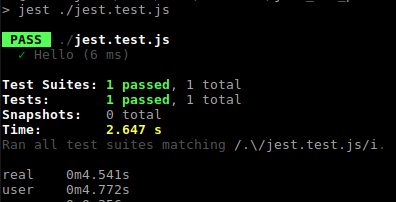

# Jest vs Ava -- the ultimate showdown!

Who can run the test the fastest?

```
const msg = 'Hello'

// Q: Expect msg to be 'Hello'
```

## Jest

```
// <-- FYI...I didn't have to import anything
test('Hello', () => {  // <-- I can just write my tests asap
  const msg = 'hello'
  expect(msg).toBe('hello')
})
```

> npm run test:jest



## Ava

```
import test from 'ava'  // <-- FYI: I had to write an extra line here, but this can be ok, because sometimes I want test.serial

test('hello', (t) => { // <-- I wanted this to be my first line...
  const msg = 'hello'
  t.is(msg, 'hello')
})
```

> npm run test:ava


###

Winner as of: (Update as perf tests change)

05/13/2020 - Ava